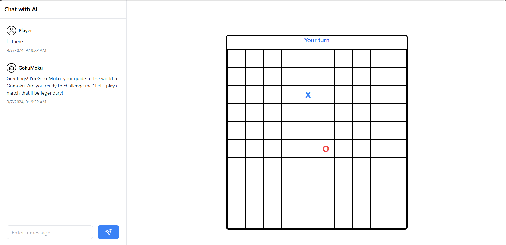

<h1 align="center">Caro-AI with LLMs🎮</h1>

Caro-AI is an intelligent AI-powered Caro (Gomoku) game that combines advanced game strategy with natural language processing to deliver an engaging and educational gaming experience. Built with a focus on AI strategy, user interaction, and learning, Caro-AI integrates cutting-edge technologies to revolutionize the classic game of Caro.

## Features ✨

- 🧠 **Advanced AI Strategy**: Utilizes the Alpha-Beta Pruning algorithm for intelligent move selection.
- 💬 **Interactive Chatbot**: GokuMoku, an AI expert in Caro, provides strategic insights and entertaining conversation.
- 🎓 **Educational Experience**: Learn advanced Caro strategies through AI explanations and suggestions.
- 🖥️ **User-Friendly Interface**: Sleek and intuitive game board with integrated chat functionality.
- 🔄 **Real-Time Updates**: Dynamic game state management for smooth gameplay.

## Product Image

<p align="center">
  
</p>

## System Architecture

Caro-AI employs a modular, scalable architecture:

1. **User Interface (React)**
   - Renders the game board and chat interface
   - Manages user interactions

2. **Game Logic**
   - Implements Caro game rules
   - Tracks game state and move history

3. **AI Engine (GokuMoku)**
   - Utilizes Alpha-Beta Pruning for move selection
   - Generates strategic explanations and evaluations

4. **Chatbot Integration**
   - Processes natural language inputs
   - Provides context-aware responses and game insights

5. **State Management**
   - Manages game state, chat history, and AI responses

### Key Components

- **useCaroGamePrompt**: Custom hook for generating AI responses and move suggestions.
- **ChatBot**: React component for rendering the chat interface and managing user interactions.
- **Game Board**: (Not shown in the provided context, but assumed to exist) Renders the Caro game board and handles moves.

## Installation 🛠️

To set up Caro-AI:

1. **Clone the repository**:
    ```bash
    git clone https://github.com/yourusername/caro-ai.git
    cd caro-ai
    ```

2. **Install dependencies**:
    ```bash
    npm install
    ```

3. **Configure environment variables**:
   Create a `.env` file in the root directory with the necessary API keys:
   ```
   GOOGLE_API_KEY=your_google_api_key
   GROQ_API_KEY=your_groq_api_key
   LANGCHAIN_SMITH_API_KEY=your_langchain_smith_api_key
   AIRTABLE_API_KEY=your_airtable_api_key
   AIRTABLE_BASE_ID=your_airtable_base_id
   AIRTABLE_TABLE_ID=your_airtable_table_id
   TAVILY_API_KEY=your_tavily_api_key
   PINECONE_API_KEY=your_pinecone_api_key
   ```

## Usage 🖥️

To start Caro-AI:

1. **Run the development server**:
   ```bash
   npm run dev
   ```

2. **Access the game**:
   Open your web browser and navigate to `http://localhost:3000` (or the port specified by your development server).

3. **Play and interact with Caro-AI**:
   - Make moves on the game board
   - Chat with GokuMoku for strategy advice and entertainment
   - Learn from AI explanations of game tactics

## Customization 🛠️

To customize Caro-AI for your specific needs:

1. **Adjust AI behavior**: Modify the prompt template in `hooks/useCaroGamePrompt.ts`.
2. **Enhance UI**: Update the ChatBot component in `components/ChatBot.tsx`.
3. **Extend game features**: Add new functionalities to the game board component.

## Contributing 🤝

We welcome contributions to Caro-AI! Here's how you can help:

1. Fork the repository
2. Create a new branch (`git checkout -b feature/AmazingFeature`)
3. Make your changes
4. Commit your changes (`git commit -m 'Add some AmazingFeature'`)
5. Push to the branch (`git push origin feature/AmazingFeature`)
6. Open a Pull Request

Please make sure to update tests as appropriate and adhere to the project's coding standards.

## License 📄

This project is licensed under the MIT License - see the [LICENSE](LICENSE) file for details.

## Acknowledgments 👏

- Thanks to all contributors who have helped shape Caro-AI
- Special thanks to the open-source community for providing amazing tools and libraries

Enjoy playing and learning with Caro-AI! 🎮🤖
